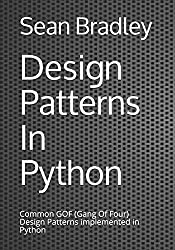

# Design Patterns In Python

This repository focuses on the 23 famous GoF (Gang of Four) Design Patterns implemented in Python.

It is supplementary to my book titled **Design Patterns In Python** (ASIN : B08XLJ8Z2J)

&nbsp;<a href="https://www.amazon.com/dp/B08XLJ8Z2J">&nbsp; https://www.amazon.com/dp/B08XLJ8Z2J</a> 
&nbsp;<a href="https://www.amazon.co.uk/dp/B08XLJ8Z2J">&nbsp; https://www.amazon.co.uk/dp/B08XLJ8Z2J</a> 
&nbsp;<a href="https://www.amazon.de/dp/B08XLJ8Z2J">&nbsp; https://www.amazon.de/dp/B08XLJ8Z2J</a> 
&nbsp;<a href="https://www.amazon.fr/dp/B08XLJ8Z2J">&nbsp; https://www.amazon.fr/dp/B08XLJ8Z2J</a> 
&nbsp;<a href="https://www.amazon.es/dp/B08XLJ8Z2J">&nbsp; https://www.amazon.es/dp/B08XLJ8Z2J</a> 
&nbsp;<a href="https://www.amazon.it/dp/B08XLJ8Z2J">&nbsp; https://www.amazon.it/dp/B08XLJ8Z2J</a> 
&nbsp;<a href="https://www.amazon.co.jp/dp/B08XLJ8Z2J">&nbsp; https://www.amazon.co.jp/dp/B08XLJ8Z2J</a> 
&nbsp;<a href="https://www.amazon.ca/dp/B08XLJ8Z2J">&nbsp; https://www.amazon.ca/dp/B08XLJ8Z2J</a>

All the code examples in the book can be found in these pages.

A Design Pattern is a description or template that can be repeatedly applied to a commonly recurring problem in software design.

A familiarity of Design Patterns will be very useful when planning, discussing, managing and documenting your applications from now on and into the future.

Also, throughout the book, as each design pattern is discussed and demonstrated using example code, I also introduce new python coding concepts with each new design pattern. So that as you progress through the book and try out the examples, you will also get experience and familiarity with some of the finer details of programming with python.

So, in this book, you will learn about these 23 Design Patterns, 

* Creational
    - [Factory](factory)
    - [Abstract Factory](abstract_factory)
    - [Builder](builder)
    - [Prototype](prototype)
    - [Singleton](singleton)
* Structural
    - [Decorator](decorator)
    - [Adapter](adapter)
    - [Facade](facade)
    - [Bridge](bridge)
    - [Composite](composite)
    - [Flyweight](flyweight)
    - [Proxy](proxy)
* Behavioral
    - [Command](command)
    - [Chain of Responsibility](chain_of_responsibility)
    - [Observer Pattern](observer)
    - [Interpreter](interpreter)
    - [Iterator](iterator)
    - [Mediator](mediator)
    - [Memento](memento)
    - [State](state)
    - [Strategy](strategy)
    - [Template](template)
    - [Visitor](visitor)

## Pattern Types

In the list of patterns above, there are Creational, Structural and Behavioral patterns.

* **Creational** : Abstracts the instantiation process so that there is a logical separation between how objects are composed and finally represented.
* **Structural** : Structural patterns focus more on how classed and objects are composed using the different structural techniques, and to form structures with more or altered flexibility.
* **Behavioral** : Are concerned with the inner algorithms, process flow, the assignment of responsibilities and the intercommunication between objects. 

## Class Scope and Object Scope Patterns

Each pattern can be further specified whether it relates more specifically classes or instantiated objects.

Class scope patterns deal more with relationships between classes and their subclasses.

Object scope patterns deal more with relationships that can be altered at runtime

| Pattern                                                                                           | Description                                | Scope  | Type        |
|---------------------------------------------------------------------------------------------------|--------------------------------------------|--------|-------------|
| Factory, Abstract Factory                                                                                | Defers object creation to subclasses       | Class  | Creational  |
| Builder, Prototype, Singleton                                                   | Defers object creation to objects          | Object | Creational  |
| Adapter, Bridge, Composite, Decorator, Facade, Flyweight, Proxy                                   | Describes a way to assemble objects        | Object | Structural  |
| Interpreter, Template                                                                             | Describes algorithms and flow control      | Class  | Behavioral |
| Chain of Responsibility, Command, Iterator, Mediator, Memento, Observer, State, Strategy, Visitor | Describes how groups of objects co-operate | Object | Behavioral |
