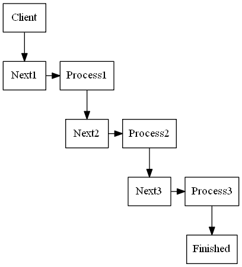

# Chain of Responsibility Design Pattern

Chain of responsibility pattern is a behavioural pattern used to achieve loose coupling
in software design.
In this example, a request from a client is passed to a chain of objects to process them.
The objects in the chain will decide how to process them and/or pas them to the next in the chain.
The objects can also modify the next in the chain if for example you wanted to run objects in a recursive manner.


## Chain of Responsibility UML Diagram



## Chain of Responsibility UML Diagram in the context of an ATM


In the ATM example, the chain is created to dispense an amount of £50, then £20s and then £10s in order.
The successor chain is hardcoded in the chain client. 

```python
def __init__(self):
    # initialize the successor chain
    self.chain1 = Dispenser50()
    self.chain2 = Dispenser20()
    self.chain3 = Dispenser10()

    # set the chain of responsibility
    # The Client may compose chains once or
    # the hadler can set them dynamically at
    # handle time
    self.chain1.set_successor(self.chain2)
    self.chain2.set_successor(self.chain3)

```
You also have the option to set the next successor on logic at handle time.

## Output
```bash
$ python atm.py
Enter amount to withdrawal
130
Dispensing 2 £50 note
Dispensing 1 £20 note
Dispensing 1 £10 note
Go spoil yourself
```