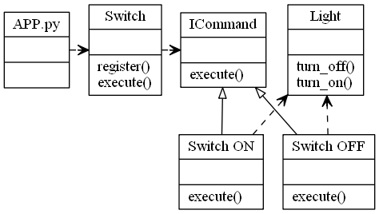

# Command Design Pattern

The command pattern is a behavioural design pattern, in which an abstraction exists between an object that invokes a command, and the object that performs it.

The components if the Command Design Pattern are,
1. **Receiver** - The Object that will receive and execute the command
2. **Invoker** - Which will send the command to the receiver
3. **Command Object** - Itself, which implements an execute, or action method, and contains all required information to execute it
4. **Client** - The application or component which is aware of the Reciever, Invoker and Commands

Eg, a button, will call the Invoker, which will call a pre registered Commands execute method, which the Reciever will perform.

A Concrete Class will delegate a request to a command object, instead of implementing the request directly.
Using a command design pattern allows you to seperate concerns a little easier and to solve problems of the concenrs independantly of each of the layers.
eg, logging the execution of a command and it's outcome.

Uses:
GUI Buttons, menus
Macro recording
Multi level undo/redo
networking - send whole command objects across a network, even as a batch
parallel processing or thread pools,
transactional behaviour
Wizards

Notes:
The receiver object should manages it's own state, not the command object
There can be one or more invokers which can execute the command at a later date.

The Command Pattern in the context of a light switch

The Command Pattern in the contect of a slider for a heater, which also implements UNDO/REDO

## Video Tutorials of the Command Pattern in Python

### Part 1 (Basics)

### Part 2 (Implementing UNDO REDO)

