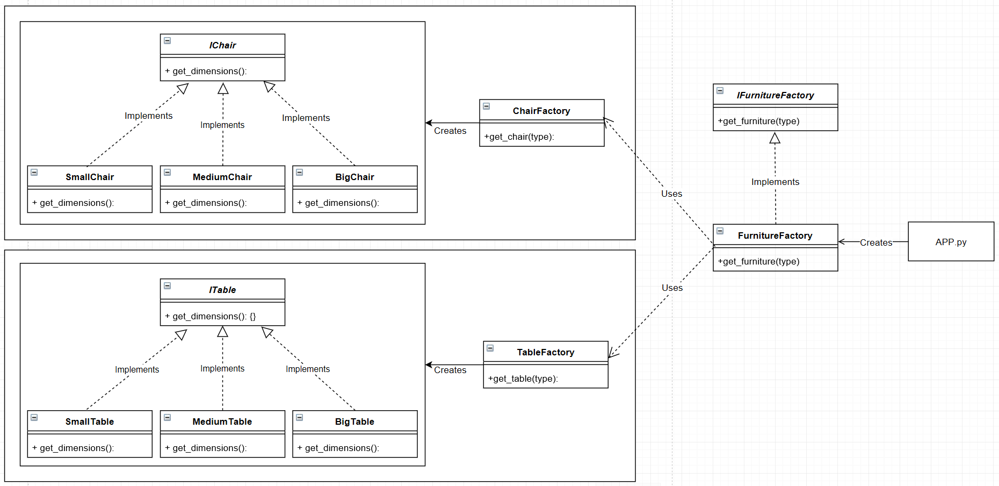

# Abstract Factory Design Pattern

The Abstract Factory Pattern adds an abstract layer over multiple factory method implementations.

The Abstract Factory contains or composites one or more than one factory method


Abstract Factory in the context of a Furniture factory



Import existing factories
```python
from chair_factory import ChairFactory
from table_factory import TableFactory
```

Create an interface
```python
class IFurnitureFactory(metaclass=ABCMeta): 
    """Furniture Factory Interface"""

    @abstractstaticmethod
    def get_furniture(furniture):
        """The static funiture factory interface method"""
```

The factories abstract static method which delegates to the correct factory
```python

class FurnitureFactory(IFurnitureFactory):  
    """The Furniture Factory Concrete Class"""

    @staticmethod
    def get_furniture(furniture):
        """Static get_furniture method"""
        try:
            if furniture in ["SmallChair", "MediumChair", "BigChair"]:
                return ChairFactory().get_chair(furniture)
            if furniture in ["SmallTable", "MediumTable", "BigTable"]:
                return TableFactory().get_table(furniture)
            raise AssertionError("No Furniture Factory Found")
        except AssertionError as _e:
            print(_e)
        return None
```


Requesting from the abstract factory at run time
```python
if __name__ == "__main__":
    FURNITURE = FurnitureFactory.get_furniture("SmallChair")
    print(f"{FURNITURE.__class__} : {FURNITURE.dimensions()}")

    FURNITURE = FurnitureFactory.get_furniture("MediumTable")
    print(f"{FURNITURE.__class__} : {FURNITURE.dimensions()}")
```
