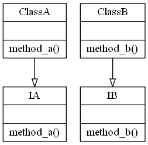
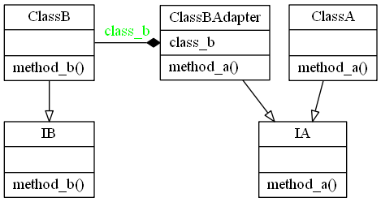

# Adapter Design Pattern

## Video Lecture

<a id="skillShareVideoLink" href="https://skl.sh/34SM2Xg" target="_blank" title="Adapter Design Pattern"></a> 
<!-- <a id="udemyVideoLink" href="https://www.udemy.com/course/design-patterns-in-python/learn/lecture/16399566/?referralCode=7493DBBBF97FF2B0D24D" target="_blank" title="Adapter Design Pattern"></a> -->

## Description

The adapter design pattern solves these problems:

- How can a class be reused that does not have an interface that a client requires?
- How can classes that have incompatible interfaces work together?
- How can an alternative interface be provided for a class?

In this lecture, I have 2 classes, they don't share the same interface. The client requires it's objects to use an already standardised interface.

So we need to create an adapter, that wraps the incompatible object, but implements the standardised interface.

## Two Incompatible Classes


## After Creating an Adapter


## Source Code

### **`adapter.py`**
```python
from abc import ABCMeta, abstractmethod


class IA(metaclass=ABCMeta):
    @staticmethod
    @abstractmethod
    def method_a():
        """An abstract method A"""


class ClassA(IA):
    def method_a(self):
        print("method A")


class IB(metaclass=ABCMeta):
    @staticmethod
    @abstractmethod
    def method_b():
        """An abstract method B"""


class ClassB(IB):
    def method_b(self):
        print("method B")


"""ClassB does not have a method_a, so we create an adapter"""


class ClassBAdapter(IA):
    def __init__(self):
        self.class_b = ClassB()

    def method_a(self):
        """calls the class b method_b instead"""
        self.class_b.method_b()


# client

#ITEM = ClassA()
#ITEM = ClassB()  # has no method_a
ITEM = ClassBAdapter()

ITEM.method_a()

```