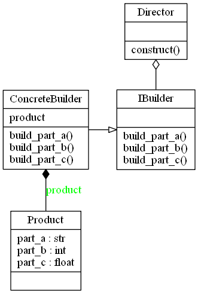
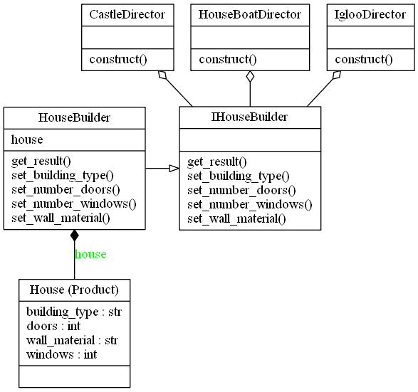

# Builder Design Pattern

## Video Lecture

Skillshare : [https://skl.sh/34SM2Xg](https://skl.sh/34SM2Xg "Builder Design Pattern")

Udemy : [Builder Design Pattern](https://www.udemy.com/course/design-patterns-in-python/learn/lecture/16396852/?referralCode=7B677DD7A9580F2FFD8F "Builder Design Pattern")

## Description

The Builder Pattern is a creational pattern whose intent is to separate the construction of a complex object from its representation so that you can use the same construction process to create different representations.

The Builder Pattern tries to solve,

- How can a class create different representations of a complex object?
- How can a class that includes creating a complex object be simplified?

The Builder and Factory patterns are very similar in the fact they both instantiate new objects at run time. The difference is when the process of creating the object is more complex, so rather than the Factory returning a new instance of `ObjectA`, it could call the builders director construct method `ObjectA.construct()`. Both return an Object.

Parts of the Builder Pattern

- **Product** - The Product being built
- **Concrete Builder** - Build the concrete product. Implements the IBuilder interface
- **Builder Interface** - The Interface which the Concrete builder should implement
- **Director** - Has a construct method which when called creates a customised product



The Builder Pattern in the context of a House Builder. There are multiple directors creating there own complex objects

.

## Source Code

### **`builder.py`**

```python
from abc import ABCMeta, abstractstaticmethod


class IHouseBuilder(metaclass=ABCMeta):
    """The Builder Interface"""

    @abstractstaticmethod
    def set_wall_material(value):
        """Set the wall_material"""

    @abstractstaticmethod
    def set_building_type(value):
        """Set the building_type"""

    @abstractstaticmethod
    def set_number_doors(value):
        """Set the number of doors"""

    @abstractstaticmethod
    def set_number_windows(value):
        """Set the number of windows"""

    @abstractstaticmethod
    def get_result():
        """Return the house"""


class HouseBuilder(IHouseBuilder):
    """The Concrete Builder."""

    def __init__(self):
        self.house = House()

    def set_wall_material(self, value):
        self.house.wall_material = value
        return self

    def set_building_type(self, value):
        self.house.building_type = value
        return self

    def set_number_doors(self, value):
        self.house.doors = value
        return self

    def set_number_windows(self, value):
        self.house.windows = value
        return self

    def get_result(self):
        return self.house


class House():
    """The Product"""

    def __init__(self, building_type="Apartment", doors=0, windows=0, wall_material="Brick"):
        #brick, wood, straw, ice
        self.wall_material = wall_material
        # Apartment, Bungalow, Caravan, Hut, Castle, Duplex, HouseBoat, Igloo
        self.building_type = building_type
        self.doors = doors
        self.windows = windows

    def __str__(self):
        return "This is a {0} {1} with {2} door(s) and {3} window(s).".format(
            self.wall_material, self.building_type, self.doors, self.windows
        )


class IglooDirector:
    """The Director, building a different representation."""
    @staticmethod
    def construct():
        return HouseBuilder()\
            .set_building_type("Igloo")\
            .set_wall_material("Ice")\
            .set_number_doors(1)\
            .set_number_windows(0)\
            .get_result()


class HouseBoatDirector:
    """The Director, building a different representation."""
    @staticmethod
    def construct():
        return HouseBuilder()\
            .set_building_type("House Boat")\
            .set_wall_material("Wooden")\
            .set_number_doors(6)\
            .set_number_windows(8)\
            .get_result()


class CastleDirector:
    """The Director, building a different representation."""
    @staticmethod
    def construct():
        return HouseBuilder()\
            .set_building_type("Castle")\
            .set_wall_material("Granite")\
            .set_number_doors(100)\
            .set_number_windows(200).get_result()


if __name__ == "__main__":
    IGLOO = IglooDirector.construct()
    HOUSE_BOAT = HouseBoatDirector.construct()
    CASTLE = CastleDirector.construct()
    print(IGLOO)
    print(HOUSE_BOAT)
    print(CASTLE)
```
