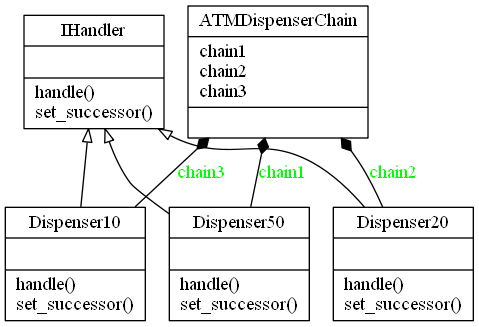

# Chain of Responsibility Design Pattern

## Video Lecture

<a id="skillShareVideoLink" href="https://skl.sh/34SM2Xg" target="_blank" title="Chain of Responsibility Design Pattern"></a>
<!-- <a id="udemyVideoLink" href="https://www.udemy.com/course/design-patterns-in-python/learn/lecture/16397342/?referralCode=7493DBBBF97FF2B0D24D" target="_blank" title="Chain of Responsibility Design Pattern"></a> -->

## Description

Chain of responsibility pattern is a behavioural pattern used to achieve loose coupling
in software design.
In this example, a request from a client is passed to a chain of objects to process them.
The objects in the chain will decide how to process them and/or pass them to the next in the chain.
The objects can also modify the next in the chain if for example you wanted to run objects in a recursive manner.


### Chain of Responsibility Diagram


### Chain of Responsibility UML Diagram in the context of an ATM


In the ATM example, the chain is created to dispense an amount of £50, then £20s and then £10s in order.
The successor chain is hard coded in the chain client. 

```python
def __init__(self):
    # initialize the successor chain
    self.chain1 = Dispenser50()
    self.chain2 = Dispenser20()
    self.chain3 = Dispenser10()

    # set the chain of responsibility
    # The Client may compose chains once or
    # the handler can set them dynamically at
    # handle time
    self.chain1.set_successor(self.chain2)
    self.chain2.set_successor(self.chain3)

```
You also have the option to set the next successor on logic at handle time.

### Output
```bash
$ python atm.py
Enter amount to withdrawal
130
Dispensing 2 £50 note
Dispensing 1 £20 note
Dispensing 1 £10 note
Go spoil yourself
```

## Source Code

### **`atm.py`**
```python
from abc import ABCMeta, abstractstaticmethod


class IHandler(metaclass=ABCMeta):
    @abstractstaticmethod
    def set_successor(successor):
        """Set the next handler in the chain"""

    @abstractstaticmethod
    def handle(amount):
        """Handle the event"""


class Dispenser50(IHandler):
    """ConcreteHandler
    Dispense £50 notes if applicable,
    otherwise continue to successor
    """

    def __init__(self):
        self._successor = None

    def set_successor(self, successor):
        """Set the successor"""
        self._successor = successor

    def handle(self, amount):
        """Handle the dispensing of notes"""
        if amount >= 50:
            num = amount // 50
            remainder = amount % 50
            print(f"Dispensing {num} £50 note")
            if remainder != 0:
                self._successor.handle(remainder)
        else:
            self._successor.handle(amount)


class Dispenser20(IHandler):
    """ConcreteHandler
    Dispense £20 notes if applicable,
    otherwise continue to successor
    """

    def __init__(self):
        self._successor = None

    def set_successor(self, successor):
        """Set the successor"""
        self._successor = successor

    def handle(self, amount):
        """Handle the dispensing of notes"""
        if amount >= 20:
            num = amount // 20
            remainder = amount % 20
            print(f"Dispensing {num} £20 note")
            if remainder != 0:
                self._successor.handle(remainder)
        else:
            self._successor.handle(amount)


class Dispenser10(IHandler):
    """ConcreteHandler
    Dispense £10 notes if applicable,
    otherwise continue to successor
    """

    def __init__(self):
        self._successor = None

    def set_successor(self, successor):
        """Set the successor"""
        self._successor = successor

    def handle(self, amount):
        """Handle the dispensing of notes"""
        if amount >= 10:
            num = amount // 10
            remainder = amount % 10
            print(f"Dispensing {num} £10 note")
            if remainder != 0:
                self._successor.handle(remainder)
        else:
            self._successor.handle(amount)


class ATMDispenserChain: # pylint: disable=too-few-public-methods
    """The Chain Client"""

    def __init__(self):
        # initialize the successor chain
        self.chain1 = Dispenser50()
        self.chain2 = Dispenser20()
        self.chain3 = Dispenser10()

        # set the chain of responsibility
        # The Client may compose chains once or
        # the hadler can set them dynamically at
        # handle time
        self.chain1.set_successor(self.chain2)
        self.chain2.set_successor(self.chain3)


if __name__ == "__main__":

    ATM = ATMDispenserChain()

    AMOUNT = int(input("Enter amount to withdrawal : "))
    if AMOUNT < 10 or AMOUNT % 10 != 0:
        print("Amount should be positive and in multiple of 10s.")
        exit()
    # process the request
    ATM.chain1.handle(AMOUNT)
    print("Now go spoil yourself")

```