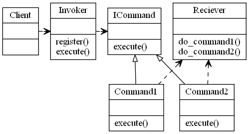

# Command Design Pattern

## Video Lecture

<a id="skillShareVideoLink" href="https://skl.sh/34SM2Xg" target="_blank" title="Command Design Pattern"></a> 
<!-- <a id="udemyVideoLink" href="https://www.udemy.com/course/design-patterns-in-python/learn/lecture/16397092/?referralCode=7493DBBBF97FF2B0D24D" target="_blank" title="Command Design Pattern"></a> -->

## Description

The command pattern is a behavioural design pattern, in which an abstraction exists between an object that invokes a command, and the object that performs it.

The components of the Command Design Pattern are,

- **Receiver** : The Object that will receive and execute the command
- **Invoker** : Which will send the command to the receiver
- **Command Object** : Itself, which implements an execute, or action method, and contains all required information to execute it
- **Client** : The application or component which is aware of the Receiver, Invoker and Commands

Eg, a button, will call the Invoker, which will call a pre registered Commands execute method, which the Receiver will perform.

A Concrete Class will delegate a request to a command object, instead of implementing the request directly.
Using a command design pattern allows you to separate concerns a little easier and to solve problems of the concerns independently of each of the layers.
eg, logging the execution of a command and it's outcome.

Uses:

- GUI Buttons, menus
- Macro recording
- Multi level undo/redo
- Networking - send whole command objects across a network, even as a batch
- Parallel processing or thread pools
- Transactional behaviour
- Wizards

Notes:
The receiver object should manages it's own state, not the command object
There can be one or more invokers which can execute the command at a later date.



The Command Pattern in the context of a light switch


## Source Code
### **`switch_command.py`**
```python
from abc import ABCMeta, abstractstaticmethod
import time


class ICommand(metaclass=ABCMeta):
    """The command interface, which all commands will implement"""

    @abstractstaticmethod
    def execute():
        """The required execute method which all command objects will use"""


class Switch:
    """The Invoker Class"""

    def __init__(self):
        self._commands = {}
        self._history = []

    @property
    def history(self):
        return self._history

    def register(self, command_name, command):
        self._commands[command_name] = command

    def execute(self, command_name):
        if command_name in self._commands.keys():
            self._history.append((time.time(), command_name))
            self._commands[command_name].execute()
        else:
            print(f"Command [{command_name}] not recognised")


class Light:
    """The Receiver"""

    def turn_on(self):
        print("Light turned ON")

    def turn_off(self):
        print("Light turned OFF")


class SwitchOnCommand(ICommand):
    """A Command object, which implements the ICommand interface"""

    def __init__(self, light):
        self._light = light

    def execute(self):
        self._light.turn_on()


class SwitchOffCommand(ICommand):
    """A Command object, which implements the ICommand interface"""

    def __init__(self, light):
        self._light = light

    def execute(self):
        self._light.turn_off()


if __name__ == "__main__":
    # The Client is the main python app

    # The Light is the Receiver
    LIGHT = Light()

    # Create Commands
    SWITCH_ON = SwitchOnCommand(LIGHT)
    SWITCH_OFF = SwitchOffCommand(LIGHT)

    # Register the commands with the invoker (Switch)
    SWITCH = Switch()
    SWITCH.register("ON", SWITCH_ON)
    SWITCH.register("OFF", SWITCH_OFF)

    # Execute the commands that are registered on the Invoker
    SWITCH.execute("ON")
    SWITCH.execute("OFF")
    SWITCH.execute("ON")
    SWITCH.execute("OFF")

    # For fun, we can see the history
    print(SWITCH.history)

```
