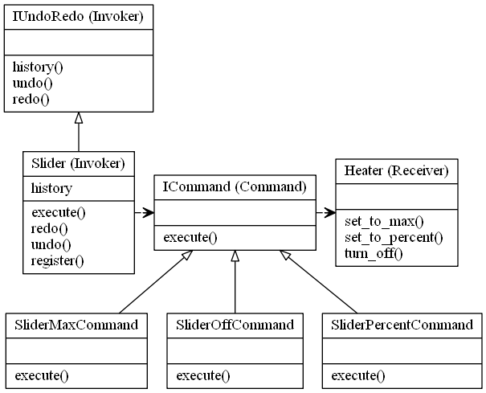

# Command Design Pattern (Undo/Redo)

## Video Lecture
Skillshare : <a href="https://skl.sh/34SM2Xg" target="_blank" title="Command (Undo/Redo) Design Pattern">https://skl.sh/34SM2Xg</a>

Udemy : <a href="https://www.udemy.com/course/design-patterns-in-python/learn/lecture/16397282/?referralCode=7B677DD7A9580F2FFD8F" target="_blank" title="Command (Undo/Redo) Design Pattern">Command (Undo/Redo) Design Pattern</a>

## Description

This is part 2 of the Command Design Pattern tutorial, where I create a slider, instead of the switch from part 1.

The slider also accepts a variable percentage, rather than an ON/OFF.

The history also records the variable setting.

And I also add UNDO/REDO to the Invoker so that you can go backwards and forwards through time.



## Source Code
### **`slider_command.py`**
```python
from abc import ABCMeta, abstractstaticmethod
import time


class ICommand(metaclass=ABCMeta):
    """The command interface, which all commands will implement"""

    @abstractstaticmethod
    def execute(*args):
        """The required execute method which all command obejcts will use"""


class IUndoRedo(metaclass=ABCMeta):
    """The Undo Redo interface"""
    @abstractstaticmethod
    def history():
        """the history of the states"""

    @abstractstaticmethod
    def undo():
        """for undoing the hsitory of the states"""

    @abstractstaticmethod
    def redo():
        """for redoing the hsitory of the states"""


class Slider(IUndoRedo):
    """The Invoker Class"""

    def __init__(self):
        self._commands = {}
        self._history = [(0.0, "OFF", ())]  # A default setting of OFF
        self._history_position = 0  # The position that is used for UNDO/REDO

    @property
    def history(self):
        """Return all records in the History list"""
        return self._history

    def register(self, command_name, command):
        """All commands are registered in the Invoker Class"""
        self._commands[command_name] = command

    def execute(self, command_name, *args):
        """Execute a pre defined command and log in history"""
        if command_name in self._commands.keys():
            self._history_position += 1
            self._commands[command_name].execute(args)
            if len(self._history) == self._history_position:
                # This is a new event in hisory
                self._history.append((time.time(), command_name, args))
            else:
                # This occurs if there was one of more UNDOs and then a new
                # execute command happened. In case of UNDO, the history_position
                # changes, and executing new commands purges any history after
                # the current position"""
                self._history = self._history[:self._history_position+1]
                self._history[self._history_position] = {
                    time.time(): [command_name, args]
                }
        else:
            print(f"Command [{command_name}] not recognised")

    def undo(self):
        """Undo a command if there is a command that can be undone.
        Update the history position so that further UNDOs or REDOs
        point to the correct index"""
        if self._history_position > 0:
            self._history_position -= 1
            self._commands[
                self._history[self._history_position][1]
            ].execute(self._history[self._history_position][2])
        else:
            print("nothing to undo")

    def redo(self):
        """Perform a REDO if the history_position is less than the end of the history list"""
        if self._history_position + 1 < len(self._history):
            self._history_position += 1
            self._commands[
                self._history[self._history_position][1]
            ].execute(self._history[self._history_position][2])
        else:
            print("nothing to REDO")


class Heater:
    """The Receiver"""

    def set_to_max(self):
        print("Heater is ON and set to MAX (100%)")

    def set_to_percent(self, *args):
        print(f"Heater is ON and set to {args[0][0]}%")

    def turn_off(self):
        print("Heater is OFF")


class SliderMaxCommand(ICommand):
    """A Command object, which implements the ICommand interface"""

    def __init__(self, heater):
        self._heater = heater

    def execute(self, *args):
        self._heater.set_to_max()


class SliderPercentCommand(ICommand):
    """A Command object, which implements the ICommand interface"""

    def __init__(self, heater):
        self._heater = heater

    def execute(self, *args):
        self._heater.set_to_percent(args[0])


class SliderOffCommand(ICommand):
    """A Command object, which implements the ICommand interface"""

    def __init__(self, heater):
        self._heater = heater

    def execute(self, *args):
        self._heater.turn_off()


if __name__ == "__main__":
    # The Client is the main python app

    # The HEATER is the Receiver
    HEATER = Heater()

    # Create Commands
    SLIDER_MAX = SliderMaxCommand(HEATER)
    SLIDER_PERCENT = SliderPercentCommand(HEATER)
    SLIDER_OFF = SliderOffCommand(HEATER)

    # Register the commands with the invoker (Switch)
    SLIDER = Slider()
    SLIDER.register("MAX", SLIDER_MAX)
    SLIDER.register("PERCENT", SLIDER_PERCENT)
    SLIDER.register("OFF", SLIDER_OFF)

    # Execute the commands that are registered on the Invoker
    SLIDER.execute("PERCENT", 10)
    SLIDER.execute("PERCENT", 20)
    SLIDER.execute("PERCENT", 30)
    SLIDER.execute("PERCENT", 40)
    SLIDER.execute("PERCENT", 50)
    print(SLIDER.history)
    SLIDER.undo()
    SLIDER.undo()
    SLIDER.undo()
    SLIDER.redo()
    SLIDER.undo()
    SLIDER.undo()
    SLIDER.execute("PERCENT", 90)
    SLIDER.execute("MAX")
    SLIDER.execute("OFF")
    print(SLIDER.history)
    SLIDER.undo()
    SLIDER.redo()

    print(SLIDER.history)


```
