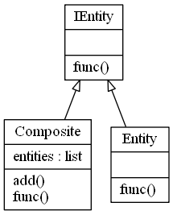

# Composite Design Pattern

The Composite design pattern,
- allows you to represent individual entities and groups of entities in the same manner.
- is a structural design pattern that lets you compose objects into a tree.
- is great if you need the option of swapping hierarchal relationships around. 
- makes it easier for you to add new kinds of components
- provides flexibility of structure
- conform to the Single Responsibility Principle in the way that it separates the aggregation of objects from the features of the object.

Examples of using the Composite Design Pattern can be seen in a filesystem directory structure, where you can swap the hierarchy of folders, and in a drawing program where you can group, un-group and transform objects, and multiple objects at the same time.

