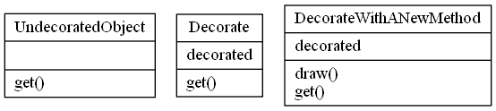

# Decorator Design Pattern

## Video Lecture

<a id="skillShareVideoLink" href="https://skl.sh/34SM2Xg" target="_blank" title="Decorator Design Pattern"></a> 
<!-- <a id="udemyVideoLink" href="https://www.udemy.com/course/design-patterns-in-python/learn/lecture/16397502/?referralCode=7493DBBBF97FF2B0D24D" target="_blank" title="Decorator Design Pattern"></a> -->

## Description
The decorator pattern is a structural pattern, that allows you to attach additional responsibilities to an object at run time.

The decorator pattern is used in both the Object Oriented and Functional paradigms.

The decorator pattern is different than the Python language feature of Python Decorators in it's syntax, but the application of it is the same, in the way that it is essentially a wrapper.

The Decorator pattern adds extensibility, without modifying the original function.



## Source Code

### **`decorator.py`**
```python
class UndecoratedObject:
    @staticmethod
    def get():
        return "UndecoratedObject"


class Decorate:
    def __init__(self, undecorated):
        self.undecorated = undecorated

    def get(self):
        return self.undecorated.get().replace("Undecorated", "Decorated")


# class DecorateWithANewMethod:
#     def __init__(self, undecorated):
#         self.undecorated = undecorated

#     def get(self):
#         return self.undecorated.get()

#     def draw(self):
#         print(self.undecorated.get())


UNDECORATED = UndecoratedObject()
print(UNDECORATED.get())
DECORATED = Decorate(UNDECORATED)
print(DECORATED.get())
#DECORATEDWITHNEWMETHOD = DecorateWithANewMethod(DECORATED)
#DECORATEDWITHNEWMETHOD.draw()

```