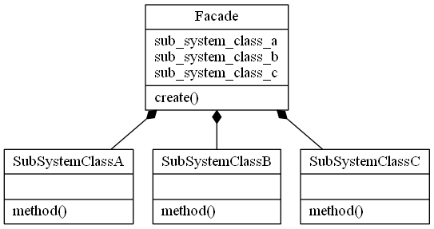

# Facade Design Pattern

## Video Lecture

<a id="skillShareVideoLink" href="https://skl.sh/34SM2Xg" target="_blank" title="Facade Design Pattern"></a> 
<a id="udemyVideoLink" href="https://www.udemy.com/course/design-patterns-in-python/learn/lecture/16397504/?referralCode=7493DBBBF97FF2B0D24D" target="_blank" title="Facade Design Pattern"></a>

## Description

The Facade Pattern is a structural design pattern.
It provides a simplified interface to a set of other interfaces, abstractions and implementations within a system that may be full of complexity and/or tightly coupled.



## Source Code

### **`facade.py`**
```python
class SubSystemClassA:
    @staticmethod
    def method():
        return "A"


class SubSystemClassB:
    @staticmethod
    def method():
        return "B"


class SubSystemClassC:
    @staticmethod
    def method():
        return "C"


# facade
class Facade:
    def __init__(self):
        self.sub_system_class_a = SubSystemClassA()
        self.sub_system_class_b = SubSystemClassB()
        self.sub_system_class_c = SubSystemClassC()

    def create(self):
        result = self.sub_system_class_a.method()
        result += self.sub_system_class_b.method()
        result += self.sub_system_class_c.method()
        return result


# client
FACADE = Facade()
RESULT = FACADE.create()
print("The Result = %s" % RESULT)

```