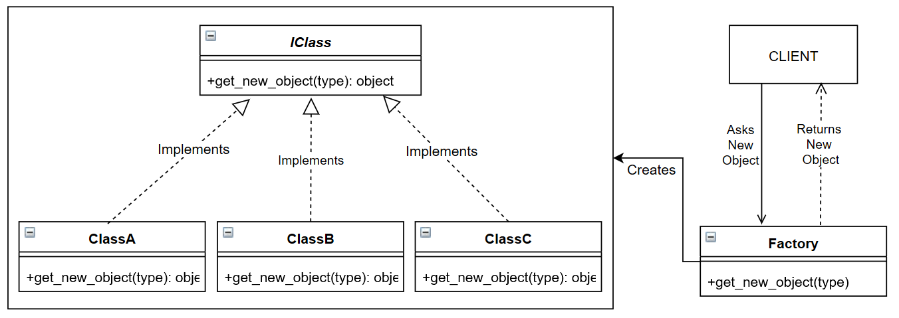
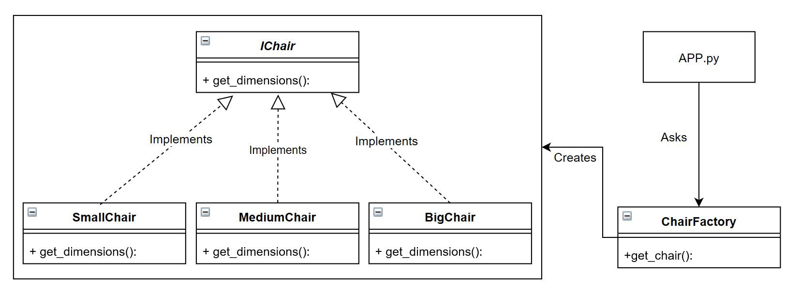

# Factory Design Pattern

## Video Lecture

<a id="skillShareVideoLink" href="https://skl.sh/34SM2Xg" target="_blank" title="Factory Design Pattern"></a> 
<a id="udemyVideoLink" href="https://www.udemy.com/course/design-patterns-in-python/learn/lecture/16396650/?referralCode=7493DBBBF97FF2B0D24D" target="_blank" title="Factory Design Pattern"></a>

## Description

The Factory Pattern is a creational pattern that defines an Interface for creating an object and defers instantiation until runtime.

Used when you don't know how many or what type of objects will be needed until or during runtime



The Factory Pattern in the context of a Chair Factory 

## Source Code

### **`chair_factory.py`**

```python
from abc import ABCMeta, abstractstaticmethod


class IChair(metaclass=ABCMeta):  # pylint: disable=too-few-public-methods
    """The Chair Interface"""

    @abstractstaticmethod
    def dimensions():
        """A static inteface method"""


class BigChair(IChair):  # pylint: disable=too-few-public-methods
    """The Big Chair Concrete Class which implements the IChair interface"""

    def __init__(self):
        self._height = 80
        self._width = 80
        self._depth = 80

    def dimensions(self):
        return {"width": self._width, "depth": self._depth, "height": self._height}


class MediumChair(IChair):  # pylint: disable=too-few-public-methods
    """The Medium Chair Concrete Class which implements the IChair interface"""

    def __init__(self):
        self._height = 60
        self._width = 60
        self._depth = 60

    def dimensions(self):
        return {"width": self._width, "depth": self._depth, "height": self._height}


class SmallChair(IChair):  # pylint: disable=too-few-public-methods
    """The Small Chair Concrete Class which implements the IChair interface"""

    def __init__(self):
        self._height = 40
        self._width = 40
        self._depth = 40

    def dimensions(self):
        return {"width": self._width, "depth": self._depth, "height": self._height}


class ChairFactory:  # pylint: disable=too-few-public-methods
    """Tha Factory Class"""

    @staticmethod
    def get_chair(chair):
        """A static method to get a table"""
        try:
            if chair == "BigChair":
                return BigChair()
            if chair == "MediumChair":
                return MediumChair()
            if chair == "SmallChair":
                return SmallChair()
            raise AssertionError("Chair Not Found")
        except AssertionError as _e:
            print(_e)
        return None


if __name__ == "__main__":
    CHAIR_FACTORY = ChairFactory().get_chair("SmallChair")
    print(CHAIR_FACTORY.dimensions())
```
