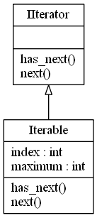

# Iterator Design Pattern

## Video Lecture

<a id="skillShareVideoLink" href="https://skl.sh/34SM2Xg" target="_blank" title="Iterator Design Pattern"></a> 
<a id="udemyVideoLink" href="https://www.udemy.com/course/design-patterns-in-python/learn/lecture/16396406/?referralCode=7493DBBBF97FF2B0D24D" target="_blank" title="Iterator Design Pattern"></a>

## Description

An interface with **next** and **has_next** methods.

**next** returns the next object in the aggregate(collection, list)

**has_next** returns a value, usually a boolean indicating if the iterable is at the end of the list or not.

The benefits of using the Iterator pattern is that the client, can traverse an aggregate without needing to understand it's internal representation and data structures.



## Source Code

### **`iterator.py`**
```python
from abc import ABCMeta, abstractmethod

class IIterator(metaclass=ABCMeta):
    @staticmethod
    @abstractmethod
    def has_next():
        """Returns Boolean whether at end of collection or not"""

    @staticmethod
    @abstractmethod
    def next():
        """Return the object in collection"""

class Iterable(IIterator):
    def __init__(self):
        self.index = 0
        self.maximum = 7

    def next(self):
        if self.index < self.maximum:
            x = self.index
            self.index += 1
            return x
        else:
            raise Exception("AtEndOfIteratorException", "At End of Iterator")

    def has_next(self):
        return self.index < self.maximum

ITERABLE = Iterable()

while ITERABLE.has_next():
    print(ITERABLE.next())

    
# print(ITERABLE.next())
# print(ITERABLE.next())
# print(ITERABLE.next())
# print(ITERABLE.next())
# print(ITERABLE.next())
# print(ITERABLE.next())
# print(ITERABLE.next())
# print(ITERABLE.next())

        
```