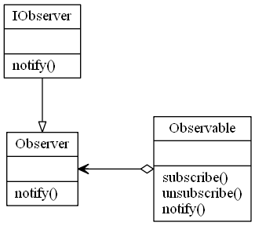

# Observer Pattern

## Video Lecture
Skillshare : <a href="https://skl.sh/34SM2Xg" target="_blank" title="Observer Design Pattern">https://skl.sh/34SM2Xg</a>

Udemy : <a href="https://www.udemy.com/course/design-patterns-in-python/learn/lecture/16397486/?referralCode=7B677DD7A9580F2FFD8F" target="_blank" title="Observer Design Pattern">Observer Design Pattern</a>

## Description

The observer pattern is a software design pattern in which an object, called the subject or observable, manages a list of dependents, called observers, and notifies them automatically of any internal state changes, and calls one of their methods. 



## Source Code

### **`observer.py`**
```python
"""
Observer Design Pattern
"""

from abc import ABCMeta, abstractmethod


class IObservable(metaclass=ABCMeta):
    @staticmethod
    @abstractmethod
    def subscribe(observer):
        """The subscribe method"""

    @staticmethod
    @abstractmethod
    def unsubscribe(observer):
        """The unsubscribe method"""

    @staticmethod
    @abstractmethod
    def notify(observer):
        """The notify method"""


class Subject(IObservable):
    def __init__(self):
        self._observers = set()

    def subscribe(self, observer):
        self._observers.add(observer)

    def unsubscribe(self, observer):
        self._observers.remove(observer)

    def notify(self, *args, **kwargs):
        for observer in self._observers:
            observer.notify(self, *args, **kwargs)


class IObserver(metaclass=ABCMeta):
    @staticmethod
    @abstractmethod
    def notify(observable, *args, **kwargs):
        """Receive notifications"""


class Observer(IObserver):
    def __init__(self, observable):
        observable.subscribe(self)

    def notify(self, observable, *args, **kwargs):
        print("Observer received", args, kwargs)


SUBJECT = Subject()
OBSERVERA = Observer(SUBJECT)
OBSERVERB = Observer(SUBJECT)

SUBJECT.notify("Hello Observers")

SUBJECT.unsubscribe(OBSERVERB)
SUBJECT.notify("Hello Observers")

```