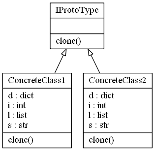

# Prototype Design Pattern

## Video Lecture

<a id="skillShareVideoLink" href="https://skl.sh/34SM2Xg" target="_blank" title="Prototype Design Pattern"></a> 
<!-- <a id="udemyVideoLink" href="https://www.udemy.com/course/design-patterns-in-python/learn/lecture/16396926/?referralCode=7493DBBBF97FF2B0D24D" target="_blank" title="Prototype Design Pattern"></a> -->
<a id="ytVideoLink" href="https://youtu.be/_jBjhI6-VDI" target="_blank" title="Prototype Design Pattern"></a> 

## Description

Prototype design pattern is good for when creating a new objects may require more resources than you want to use or have available, versus just making a new copy in memory.
Eg, A file you've downloaded from a server may be large, but since it is already in memory, you could just clone it, and work on the new copy independently of the original.

In the prototype patterns interface, you create a static clone method that should be implemented by all classes that use the interface.
How the clone method is implemented in the concrete class is up to you.
You will need to decide whether a shallow or deep copy is required.

- A shallow copy, copies and creates new references 1 level deep,
- A deep copy, copies and creates new references for all levels.

In Python you have mutable objects such as Lists, Dictionaries, Sets and any custom Objects you have created. A shallow copy, will create new copies of the objects with new references in memory, but the underlying data will point to the same location as the original copy. Be sure to test your implementation that
the copy method you use works as you expect. 



## Source Code

### **`prototype.py`**

```python
from abc import ABCMeta, abstractstaticmethod
import copy


class IProtoType(metaclass=ABCMeta):
    """interface with clone method"""
    @abstractstaticmethod
    def clone():
        """The clone, deep or shallow, is up to how you 
        want implement the details in your concrete class?"""


class ConcreteClass1(IProtoType):
    """concrete class 1"""

    def __init__(self, i=0, s="", l=[], d={}):
        self.i = i
        self.s = s
        self.l = l
        self.d = d

    def clone(self):
        return type(self)(
            self.i,
            self.s,
            self.l.copy(),
            self.d.copy())

    def __str__(self):
        return f"{id(self)}\ti={self.i}\ts={self.s}\tl={self.l}\td={self.d}"


class ConcreteClass2(IProtoType):
    """concrete class 2"""

    def __init__(self, i=0, s="", l=[], d={}):
        self.i = i
        self.s = s
        self.l = l
        self.d = d

    def clone(self):
        return type(self)(
            self.i,
            self.s,
            copy.deepcopy(self.l),
            copy.deepcopy(self.d))

    def __str__(self):
        return f"i={self.i}\t\ts={self.s}\tl={self.l}\td={self.d}\n{id(self.i)}\t{id(self.s)}\t{id(self.l)}\t{id(self.d)}\t"


if __name__ == "__main__":

    OBJECT1 = ConcreteClass1(
        1,
        "OBJECT1",
        [1, 2, 3],
        {"a": 4, "b": 5, "c": 6}
    )
    print(f"OBJECT1 {OBJECT1}")

    OBJECT2 = OBJECT1.clone()
    OBJECT2.s = "OBJECT2"
    OBJECT2.l[0] = 10
    print(f"OBJECT2 {OBJECT2}")
    print(f"OBJECT1 {OBJECT1}")

```