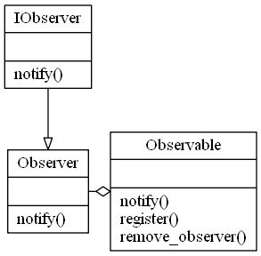

# Observer Pattern

The observer pattern is a software design pattern in which an object, called the subject, maintains a list of its dependents, called observers, and notifies them automatically of any state changes, usually by calling one of their methods. 

It is mainly used to implement distributed event handling systems, in "event driven" software. Most modern languages such as C# have built-in "event" constructs which implement the observer pattern components. 

The observer pattern is also a key part in the familiar model–view–controller (MVC) architectural pattern.[1] The observer pattern is implemented in numerous programming libraries and systems, including almost all GUI toolkits. 

Description Wikipedia : CC BY-SA : https://en.wikipedia.org/wiki/Observer_pattern 

