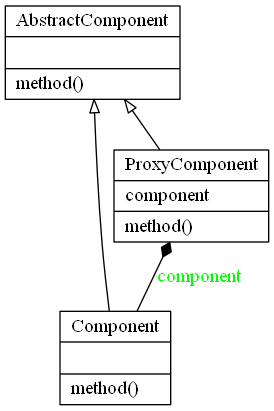

# Proxy Design Pattern

The proxy design pattern is a class functioning as an interface to another class or object.

A proxy could be for anything, such as a network connection, an object in memory, a file, or anything else you need to provide an abstraction between.

It is a wrapper called by a client to access the real underlying object.

Additional functionality can be provided at in the proxy abstraction if required.
eg, caching, authorization, validation, lazy initialization, logging.

The proxy should implement the subject interface as much as practicable so that the proxy and subject appear identical to the client.

The Proxy Pattern may occasionally also be referred to as Monkey Patching or 
Object Augmentation

## Video Tutorial

